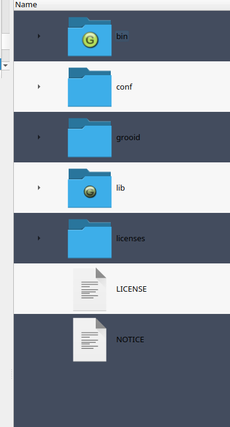
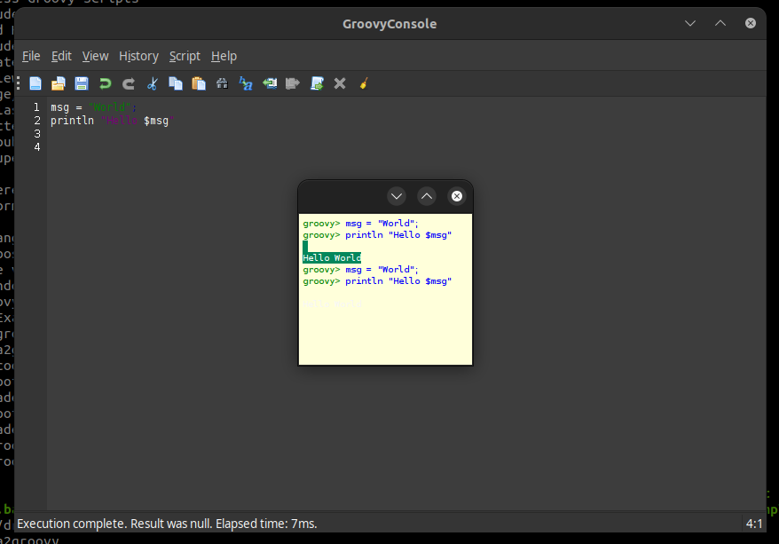

Exercice d'installation de Groovy
====================================

## Abstract

Dans ce tout premier exercice, nous allons découvrir le SDK de Groovy et les différents utilitaires fournis.

## Contenu

Dans ce tout premier exercice, nous allons découvrir le SDK de Groovy et les différents utilitaires fournis.

### Possibilités d'installation

Il est possible d'utiliser Groovy de plusieurs façons :

* Téélécharger une distribution contenant les binaires ( et ou les sources )
* Installer Groovy en utilisant votre package manager
* Utiliser directement les JAR de Groovy via vos outils de Build comme Maven ou Gradle
* Télécharger la dernière version du plugin dans votre IDE
* Télécharger le source de Groovy et construire sa propre version
* Il est possible de démarrer une instance Docker et l'utiliser au sein d'un container

### Téléchargement du Groovy SDK

Nous allons utiliser directement la distribution binaire + sources en téléchargeant le package depuis la page : 

[Page de téléchargement](https://groovy.jfrog.io/ui/native/dist-release-local/groovy-windows-installer/groovy-4.0.5/)

ou

[Page de téléchargement](https://groovy.jfrog.io/ui/native/dist-release-local/groovy-zips/apache-groovy-sdk-4.0.5.zip)

## Décompression de l'archive

Si vous avez télécharger le zip, décompresser dans un répertoire facile d'accès en ligne de commande comme `c:\groovy`.



## Les utilitaires

Groovy fournit les utilitaires suivants :

| **Commande**  | **Utilisation**                                      |
|---------------|------------------------------------------------------|
| groovysh      | Ligne de commande interactive pour utiliser Groovy   |
| groovyConsole | Interface graphique pour utiliser Groovy             |
| groovy        | Exécuteur de scripts Groovy ( comme un interpréteur) |
| groovy        | Compilateur Groovy                                   |
| grape         | Outil pour inspecter le cache Grape                  |
| groovydoc     | Génération de la documentation à partir du code      |
| startGroovy   | Script pour initialiser l'environment Groovy         |

## Pour démarrer

Lancer le script groovyConsole pour disposer d'une interface graphique afin de tester vos premiers scripts Groovy.



Insérer le code suivant :

```groovy
msg = "World"
println "Hello $msg"
```
Exécuter le code en tapant CTRL + ENTER

Que produit l'exécution du script ? 

## Utilisation en ligne de commande

Ouvrez un terminal et appelez le script `startGroovy.bat / startGroovy`.

Puis utilisez la commande `groovysh` :

et tapez les lignes suivantes : 

```
x = 10 // ENTER
y = 20 // ENTER
x + y //ENTER
```

* Quel et le résultat ?

Nous pouvons également créer une liste d'objets avec la syntaxe suivante: 

```
liste = [1,5,10]
```

Il est possible d'afficher le type d'une variable avec la méthode `dump`: 

```
liste.dump()
```

Il est également possible d'avoir la taille de la liste avec : 

```
liste.size()
```

Nous voulons compter les éléments plus grands que 5 : 

```
liste.count { it > 5 }
```

Nous pouvons également calculer une somme ainsi : 

```
liste.sum()
```

Les chaînes de caractères existent aussi notamment et peuvent être exprimées entre guillemets :

```
str = "Chaine de caractère"
```

Et extraire un caractère en faisant : 

```
str[0]
```

Ou en utilisant un intervalle

```
str[0..4]
```
## Utilisation du compilateur

Créer un fichier `Example.groovy`

Copiez coller le code suivant : 

```groovy
class Example {
    public void method() {
        System.out.println("Test")
    }
}
```

Compilez le fichier avec : 

```bash
groovyc Example.groovy
```

Vous pouvez désormais exécuter le script avec : 

```bash
export GROOVY_HOME=/home/sleroy/temp/groovy-4.0.5 
java -cp ".:/$GROOVY_HOME/lib/*" Example         
```

Il est possible de faire quelque chose de plus simple avec : 

```bash 
groovy Example.groovy
```

## Les IDE

Voici une page de résumé des IDE disponibles :

[https://groovy-lang.org/ides.html](IDE Supportés)

* VSCode avec les extensions Groovy et Code Runner.
* Eclipse avec le plugin Groovy : [https://github.com/groovy/groovy-eclipse/wiki](lien)
* IntelliJ IDEA (community ou payante)
